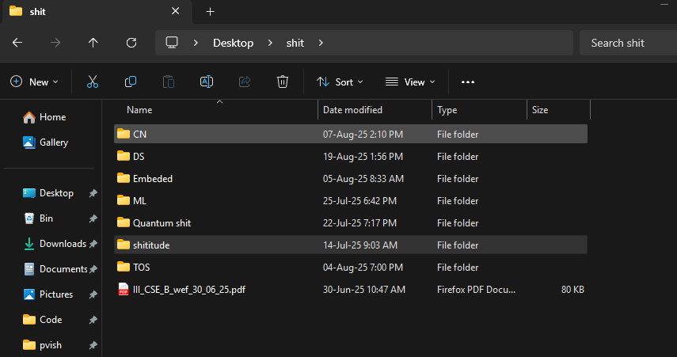

# Folder Creator & VS Code Opener

A Windows automation tool that provides a sleek GUI interface for creating folders and automatically opening them in Visual Studio Code from the current File Explorer location.

## Features

- 📁 **Smart Folder Creation**: Creates folders in the currently active File Explorer window
- 🚀 **VS Code Integration**: Automatically opens the new folder in Visual Studio Code
- ⌨️ **Keyboard Shortcuts**: ESC to cancel, Enter to confirm


## Prerequisites

- Windows 10/11
- Python 3.6+
- PyQt6
- Visual Studio Code
- PowerShell

## Installation

1. **Clone this repository:**
   ```bash
   git clone "https://github.com/saketh-exe/bookish-octo-spork.git"
   cd CreateAndOpen
   ```

2. **Install Python dependencies:**
   ```bash
   pip install PyQt6
   ```

3. **Update file paths in the scripts:**
   - Edit `create-and-open.ps1` and update the hardcoded paths to match your installation directory
   - Edit `run-script.bat` and update the path to the PowerShell script

## Usage
## Important : 
- ###  Your desired location must be open in file explorer 
- ### Windoes Defender might block when your location is Root Folder
### Method 1: Use shortcut apps like PowerToys (recommended):
1. Assign a keyboard shortcut for `run-script.bat`
### Method 2: Direct Execution
1. Navigate to a folder in File Explorer where you want to create a new subfolder
2. Run `run-script.bat` or execute the PowerShell script directly
3. Enter the desired folder name in the popup dialog
4. Press Enter to create the folder and open it in VS Code

### Method 3: PowerShell
```powershell
# Make sure File Explorer is focused on the desired location
.\create-and-open.ps1
```

## How It Works

1. **File Explorer Detection**: The PowerShell script detects the currently active File Explorer window
2. **GUI Input**: Launches a Python GUI application for folder name input
3. **Folder Creation**: Creates the new folder in the detected File Explorer location
4. **VS Code Launch**: Automatically opens the new folder in Visual Studio Code

## File Structure

```
CreateAndOpen/
├── README.md              # This file
├── main.py                # PyQt6 GUI application for user input
├── create-and-open.ps1    # Main PowerShell automation script
├── run-script.bat         # Batch file launcher
└── output.txt             # Temporary file for inter-process communication
```

## Configuration

### Customizing Paths
Update the hardcoded paths in `create-and-open.ps1` and `run-script.bat` to match your installation:
### In `create-and-open.ps1` file:
```powershell
# Update these paths:
-ArgumentList "YOUR_PATH/main.py"
-RedirectStandardOutput "YOUR_PATH/output.txt"
$name = Get-Content "YOUR_PATH/output.txt"
```
### In `run-script.bat` file:
```
powershell.exe -File "YOUR_PATH/create-and-open.ps1"
```
## Current Issues:
- Opens a cmd terminal needed for launching Python GUI in foreground
- Built on Python so it's a bit slow while launching
## Troubleshooting

### Common Issues

1. **"Python not found"**
   - Ensure Python is installed and added to your system PATH
   - Try using the full path to python.exe in the PowerShell script

2. **"Module not found: PyQt6"**
   - Install PyQt6: `pip install PyQt6`

3. **"Access denied" or permission errors**
   - Run as administrator if needed
   - Check that the target directory is writable

4. **File Explorer not detected**
   - Make sure File Explorer window is open and visible
   - Click on the File Explorer window to ensure it's active

### Debug Mode
To debug issues, you can run the Python script directly:
```bash
python main.py
```

## Contributing

1. Fork the repository
2. Create a feature branch
3. Make your changes
4. Test thoroughly on Windows
5. Submit a pull request

## License

This project is open source. Feel free to use, modify, and distribute as needed.

## Future Enhancements
- [ ] Compiled languages integration
- [ ] Support for multiple File Explorer windows
- [ ] Configuration file for customizable settings
- [ ] Alternative editors support (beyond VS Code)
- [ ] Folder template options
- [ ] Keyboard shortcut registration
- [ ] System tray integration

## Screenshots

File Explorer:


Script in Action:
- it shows python process no (PID) too  


Done and Opened in VS Code:


---

**Note**: This tool is designed specifically for Windows and requires Visual Studio Code to be installed and accessible via the `code` command in PATH.
